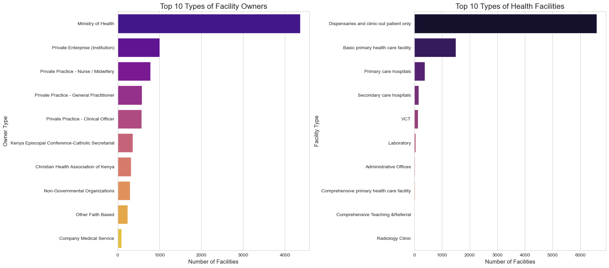

# Kenyan Healthcare Landscape Analysis (2017)
**Author:** John Apollos Olal

**Date:** September 2025

**GitHub:** [JohnApollos](https://github.com/JohnApollos)

---

## Project Summary
This project provides a comprehensive analysis of the healthcare landscape in Kenya using the official Master Health Facility List (KMHFL) from **August 2017**.  

The primary goal was to clean, analyze, and visualize the data to uncover key patterns in the **distribution, ownership, and types of health facilities** across the country.  

The analysis involved:
- Data wrangling with **Pandas**
- Creating insightful charts with **Matplotlib** and **Seaborn**
- Developing a final interactive **choropleth map** using **GeoPandas** and **Folium**

**Key findings** reveal:
- High concentration of facilities in **Nairobi County**
- The **Ministry of Health** as the dominant owner
- A healthcare system structured mainly around **primary care dispensaries and outpatient clinics**

---

## Key Questions Answered
### 1. Where are the health facilities concentrated in Kenya?

- Nairobi County has the highest number of facilities by a significant margin, with over 780 institutions.

- Other counties with high concentrations include Meru, Kiambu, and Nakuru.

### 2. Who owns the majority of health facilities?

- The Ministry of Health is the single largest owner, operating a vast network of public facilities.

- The private sector is also a major contributor, though it is fragmented across private enterprises, individual practitioners (nurses/midwives), and faith-based organizations (FBOs).

### 3. What are the most common types of health facilities?

- The healthcare system is heavily reliant on primary care, with "Dispensaries and clinic-out patient only" being the most common facility type by a large margin.

## Key Visualizations
### 1. Distribution of Health Facilities Across Top 20 Counties
This chart shows the number of health facilities per county, highlighting the urban concentration in Nairobi. 
.

### 2. Breakdown of Facility Ownership and Type
These charts illustrate the dominance of the Ministry of Health and the prevalence of primary care dispensaries.


3. Choropleth Map of Health Facility Density in Kenya
This interactive map provides a geospatial view of facility distribution, with darker colors indicating a higher number of facilities.


---

## Technical Skills & Tools
- **Data Manipulation:** Pandas

- **Data Visualization:** Matplotlib, Seaborn

- **Geospatial Analysis:** GeoPandas, Folium

- **Environment:** Jupyter Notebook

- **Programming Language:** Python

---

## Data Sources
- **Primary Dataset:** Kenya Health Facilities (August 2017) from the [Humanitarian Data Exchange (HDX)](https://data.humdata.org/dataset/kenya-health-facilities-in-kenya), originally sourced from the Kenya Ministry of Health.

Geospatial Data: [Kenyan Counties GeoJSON](https://open.africa/dataset/kenya-counties-json/resource/4fb2e27e-c001-4b7f-b71d-4fee4a96a0f8?view_id=919b8909-03a8-4127-b63c-cc815620cea1) for county boundary mapping.

---

## Project Structure
kenya-health-analysis/
│
├── kenya-health-facilities-2017_08_02.xlsx  # The raw health facility data
├── kenyan-counties.geojson                # The geospatial data for county boundaries
├── Health_Facility_Analysis.ipynb         # The main Jupyter Notebook with all the code and analysis
└── README.md                              # This file

---

## How to Run This Project
**1. Clone the repository:**
```bash

git clone [https://github.com/JohnApollos/Kenyan-Healthcare-Landscape-Analysis-2017-.git](https://github.com/JohnApollos/Kenyan-Healthcare-Landscape-Analysis-2017-.git)
```

**2. Navigate to the project directory:**
```bash

cd kenya-health-analysis
```

**3. Install the required libraries:**
```bash

pip install pandas openpyxl matplotlib seaborn geopandas folium
```

**4. Launch Jupyter Notebook:**
```bash

jupyter notebook
```

Open the Health_Facility_Analysis.ipynb file and run the cells.
